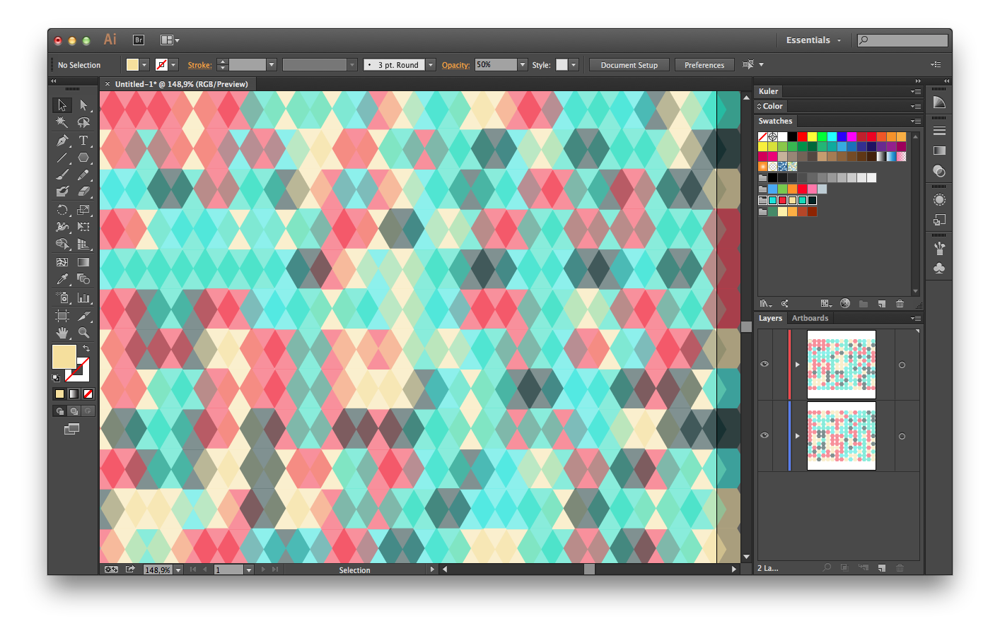

# Randomize Colors 

Randomly applies fill and stroke colors from the selected swatches to all selected items.

[Download](https://raw.github.com/davidderaedt/CSscripts/master/illustrator/randomizeColors/randomizeColors.jsx)

